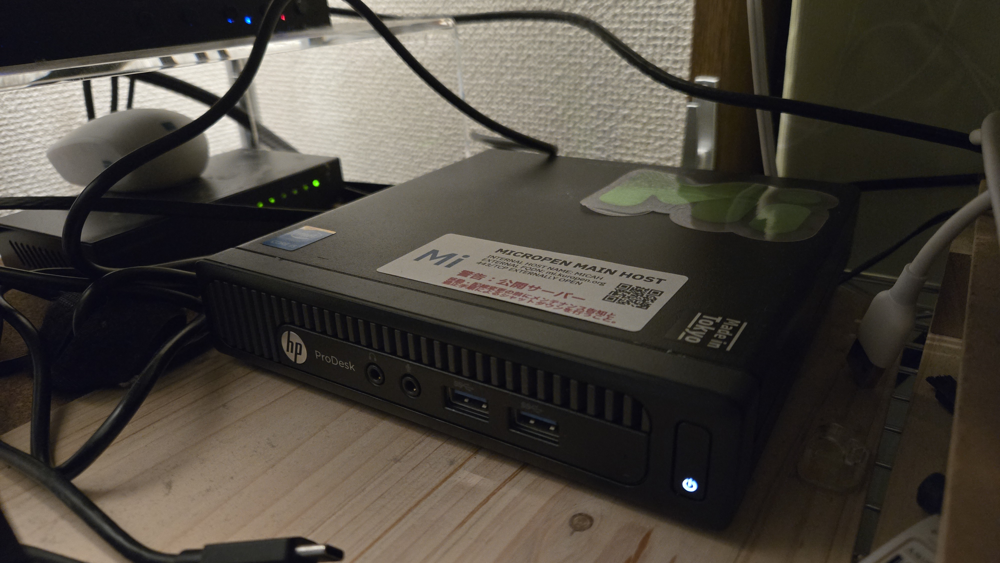

# MICROPEN

このページはKuropenの自営Misskeyサーバー・[MICROPEN](https://mi.kuropen.org/)の紹介です。2022年12月30日に開設しました。

## 目的
元々はNERV防災アプリなどで知られるゲヒルン石森社長がFediverseの利用法として提唱する[ドメインでアイデンティティを確立する](https://web.archive.org/web/20230127050725/https://isid.ai/diary/2017/04/14/1179/)という思想に基づき、
自分自身の発信に責任を持つとともに自由を確保し、あわせてサーバーインフラ運用に関する検証・実験を行える空間の確保を目的としています。

なお、別サーバーのMastodonを利用していた親族に対して、サーバー不調に伴う利用継続のためにアカウントを提供したことをきっかけに、自分専用のサーバーという位置づけではなくなっていますが、
完全紹介制という位置づけは維持し、無条件に登録を開放する予定はありません。

## サーバー

現在は自宅に設置しているサーバーで運用しています。

- 機種名: HP ProDesk 400 G1 DM
- CPU: Intel Core i5-4590T
- メモリ: 16GB
- SSD: 512GB (現時点では200GB割り当て済み)
- OS: Ubuntu 24.04
- 備考: 2025年10月に導入した中古デスクトップPC

サマリープロキシおよびセンシティブ判定はRailway上のコンテナを利用しています。  
画像等のストレージは Cloudflare R2 を利用しています。当サーバーではリモートメディアのキャッシュを行っておりません。

## 運営ポリシー
前述のとおり個人専用サーバーではありませんので、運営ポリシーを公表します。

### 用語の定義

* 本サービス: MICROPENを指します。  
* サーバー管理者: Kuropenを指します。  
* モデレーター: サーバー管理者、もしくはサーバー管理者が指定したコンテンツ管理権限を有する者を指します。  
* Fediverseサーバー: Misskey、 Mastodon その他の ActivityPub プロトコルでサーバー間通信が可能なサーバーを指します。  
* リモートサービス: 本サービスに接続する、他のFediverseサーバーを指します。  
* 利用者: 本サービスにUGCを投稿するユーザーを指します。ただしこの文書においては、リモートサービスにアカウントが存在し、当サーバーに間接的に投稿が送信されているユーザーのことは、「リモートユーザー」として区別します。

### ユーザー登録

* 本サービスへのユーザー登録は招待制です。登録には、サーバー管理者またはすでに本サービス上にアカウントを有する利用者から発行された招待コードが必要です。  
* 本サービスへの登録は満16歳以上の個人に限ります。利用者は、サーバー管理者から求められた場合は年齢を証明する必要があります。また、本サービス上にアカウントを有する利用者（botアカウントは除きます）は、アカウントプロフィールの「誕生日」欄を嘘偽りなく記載するものとします。  
* 反社会的勢力等（暴力団・暴力団関係企業・総会屋・社会運動等標榜ゴロ・特殊知能暴力集団など）との関係がある方は、本サービスへの登録をお断りいたします。  
* 本サービスにすでにアカウント（すでに凍結されたものを含みます）を持っている場合、多重アカウントの登録はお断りいたします。ただし、botの開発・運用に用いるアカウントで以下の要件に従う場合、もしくはサーバー管理者の特認を得た場合を除きます。  
  * 当該アカウントにbotフラグを付与すること  
  * 当該アカウントにて公開範囲が「パブリック」となる投稿を行わないこと  
  * 当該アカウントにて、フォローもメンションもしていない対象をメンションする投稿を行わないこと  
* 本サービスへの登録は、主として日本語ないし英語での投稿を行う場合に限ります。  
* 本サービスのログイン認証に用いる情報は適切に管理するものとし、第三者に利用させてはいけません。第三者に利用された場合であっても、そのアカウントを利用して行われた行為により発生した結果は、そのアカウント保持者本人に責任があるものとします。  
* Torや公開VPNといった匿名化措置を適用した状態で本サービスへのユーザー登録を行うことは禁止します。

### 禁止事項

以下に該当するものは、本サービスに投稿してはいけません。  
なお、ここに記載がない類型であっても、モデレーターが著しく不適切と判断したものは禁止となることがあります。

#### 法令・公序良俗に違反するもの

日本国またはシンガポール共和国の法令や、公序良俗に反するものは投稿してはいけません。

特に、以下のようなものは厳禁とします。

* 日本国またはシンガポール共和国の法令によって所持や配布が禁じられているファイル類（例として、コンピュータウイルス・児童ポルノなど）をアップロードする行為  
* 賭博を斡旋し、または賭博場（オンラインカジノを含み、公営競技場は除く）に誘客する行為

#### 他人の権利を侵す行為

誹謗中傷、嫌がらせ、著作権や肖像権の侵害、なりすましなど、他人の権利を侵すような投稿は厳禁とします。

以下のような要素での差別的な投稿は厳禁とします。

* 年齢  
* 性別・性的指向 （生物学的・遺伝的なもの、後天的に変更されたもののいずれも含みます）  
* 婚姻（同性間における相当する契約を含む）の有無  
* 障害・疾病・妊娠の有無  
* 人種・肌の色・国籍・出身国または出身地・民族  
* 宗教・信仰  
* 職業・所属する企業ないし団体

軍隊・自衛隊・警察その他の法執行機関の施設や出動現場の写真・映像（人員・装備や作戦内容などの詳細が判別可能なもの）や、
施設管理者による指示に反して撮影・録音されたファイルをアップロードすることなどの、
公開することによって第三者の業務を妨害するおそれのある投稿も禁止されます。
（公益通報に該当する場合はこの限りではありません。）

#### スパム行為

以下のような、スパム行為もしくはそれを助長するものは投稿してはいけません。

* 以下のような不正なウェブサイトへのリンクを行う、または不正なウェブサイトのURLもしくはそれを記録した二次元コードが印字された画像を掲載すること
    * そのウェブサイトの内容が、本サービスに直接投稿されていればこのUGCガイドラインに抵触するであろう内容であるもの  
    * ユーザーアカウントなど個人情報の窃取など、人に身体・権利・財産などの面で損害を与えることを企図したウェブサイト  
    * 諜報活動や匿名・流動型犯罪グループに悪用されうるようなクローズドチャットへの招待
* 正当な理由なく、不特定多数の利用者に対して大量のメンションを送る行為  
* Xの「コミュニティノート」などがついた投稿の本文を引用し本サービスで利用・転載する行為  
* 災害時における救援要請と紛らわしい行為

また、以下のような迷惑行為も禁止します。

- 必要以上に頻繁な再読み込みなど、本サービスに対して過度な負荷をかける行為
- 本サービスに使用されているソフトウェアに関して、サーバー管理者の許可または指示を受けずに、その開発者に直接問い合わせる行為
- リモートユーザーの投稿を収集・分析するために本サービスのAPIその他の機能を利用する行為
- その他本サービスの円滑な運営の妨げとなる行為
- AIエージェント型ブラウザなどの自動操作されたクライアントを利用した投稿（本サービスにおける標準機能として提供されているAPIを用いた場合、その他別途明示的に許可されている場合はこの限りではありません。）

#### 政治的行為ならびに募集行為

本サービスを政治団体への勧誘や、公職選挙における支持・不支持・投票・不投票の呼びかけといった政治的行為に利用することは禁止します。

また、法令への抵触や犯罪の助長などのトラブルを防止する観点から、本サービスを以下のような募集行為に利用することも禁止します。

* 宗教団体への勧誘や、宗教団体への寄付を求める行為  
* 友人関係における一般的なコミュニケーションの範囲を超えて、本サービス上にて恋愛または婚約（同性間において行われる相当する契約を含む。以下同じ）の相手方を募集し、または本サービスを利用して恋愛または婚約を仲介・斡旋する行為  
* 就職を斡旋する行為（具体的には、職業安定法にいう職業紹介・労働者の募集または募集情報等提供のいずれかに該当する行為）

#### 秘匿の必要がある内容

以下のような内容の投稿は、投稿先にその内容を一時的に隠すことができる機能がある場合はそれを利用して投稿する必要があります。  
それを利用せずに、あるいはそのような機能がない場所で、以下のような投稿を行うことは禁止されます。

* アダルト画像などの年齢制限の設定を要する投稿  
* 光過敏性発作その他の肉体的ないし精神的被害を引き起こす可能性のある画像・映像

### 禁止事項が発生した場合の対処

禁止事項に該当した投稿は、削除されます。  
ただし、リモートサービスから転送された投稿に関しては、この処分の効力は本サービスのみに及び、転送元のリモートサービスや、他のFediverseサーバーに転送されたものは残ります。

また禁止事項の内容が悪質である場合、もしくは反復した場合は、以下のような措置がとられることがあります。

* 新規の投稿を禁止する措置  
* リモートサービスから転送された投稿である場合、当該リモートサービスの運営者への情報提供  
* 警察その他の法執行機関への情報提供

モデレーターは、処分およびその撤回に関しての判断に関する完全な裁量権を有し、利用者に対してその判断に対する責任を負わず、また、その判断の理由を開示する義務はないものとします。

### 著作権その他の知的財産権

* 本サービス上に投稿された情報に関する著作権その他の知的財産権は、原則として当該投稿を行った利用者（その投稿した内容に関して利用者以外の権利者が存在する場合は、その権利者）に当然に帰属します。  
* 利用者は、投稿を行った時点で、その投稿に関する複製権・公衆送信権・送信可能化権・翻案権を、サーバー管理者に対して非独占的に許諾したものとみなします。なお、投稿先がFediverseサーバーである場合は、投稿を行った時点で、サーバー管理者に対して、リモートサービスを運営する者に対してこれらを再使用許諾する権利を許諾したものとみなします。また、これらに関連して著作者人格権を行使しないものとします。

### 免責事項

本サービスは現状有姿にて提供され、その品質については可能な限りの維持向上に努めますが、一切の保証をいたしません。  
本サービスを利用したこと、または利用できなかったことにより、利用者に損害が生じた場合でも、サーバー管理者は一切の責任を負わないものとします。

#### サーバー間通信に関する免責事項

- サーバー間通信が、通信状況やサーバー間の仕様相違を原因として、意図通りに反映されない、もしくは大幅に遅延する場合があります。それにより誤解を招くようなことがあっても、サーバー管理者は一切の責任を負いません。
- 一部のリモートサービスでは投稿を編集する機能がありますが、当サーバーのシステムは編集された情報の反映には対応していないため、古い情報が表示されます。
- 不特定多数が登録・利用できる状態にあって、モデレーターが存在しない、ないしは応答しないリモートサービスについては、原則として通信を遮断します。

#### 外国法に関する免責事項

サーバー管理者は、外国法（日本国以外の法域において施行されている法令をいいます）によって課せられる義務、ならびに外国法に基づいて認められる利用者の権利について、原則として対応しないこととします。

#### ロールバックに関する免責事項

当サーバーに障害が発生した場合、サーバー管理者は、サーバー上のすべての内容を障害発生前の段階に復元することができます。  
利用者は、これが行われた場合、復元基準時以降に追加もしくは変更したすべての内容が失われることに同意し、また、それらの保全を請求できないものとします。

## 各種連絡・発信について

- 当サーバーの運営に関する連絡（招待コードの請求を含む）は、以下までお願いいたします。
    - Fediverseへのアクセスができる方: `@kuropen@mi.kuropen.org` へのメンションをお願いします。
    - Fediverseにアカウントをお持ちでない方、または機密にかかわる連絡: https://inquiry.kuropen.org/ のフォームをご利用ください。
- 障害情報の発信
    - ステータスページ: https://mi-status.kuropen.me/
    - Fediverseアカウントでは、 [@kuropen@fedibird.com](https://fedibird.com/@kuropen) で発信する場合があります。
