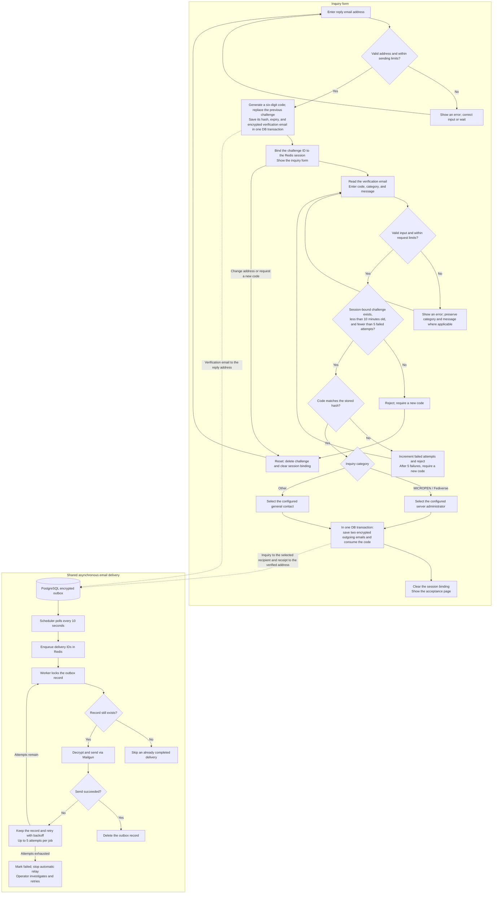

# Kuropen.org inquiry

## Notes

This system is prototyped by OpenAI Codex, GPT-6.0 Astra.

## Overview

This is a inquiry form, finally located at https://inquiry.kuropen.org/.

To avoid abuse of E-Mail address (both the site administrator and someone who discloses for public interest), this system verifies the user's address first sending one-time PIN.

## Technology Stack
- Laravel 13
- Docker
- Railway (for production environment)

## Request and email delivery flow

The chart shows the production configuration: Laravel Octane with FrankenPHP, PostgreSQL for verification and encrypted outgoing mail, and Redis for sessions, rate limiting, and delivery jobs. An accepted inquiry is saved for delivery; it does not mean both emails have already been delivered.

If either form transaction fails, its database changes are rolled back and the form reports an error. Redis enqueue failures leave outgoing mail available for the next scheduler run. Pending deliveries enqueued more than an hour ago can be enqueued again; completed records are skipped. Delivery acknowledgments can still be lost, so an external email provider may receive a duplicate.

The local default uses the database queue and logs emails instead of using the production outbox/Redis/Mailgun path. Scheduled maintenance removes expired challenges hourly and prunes failed queue jobs older than seven days daily.

